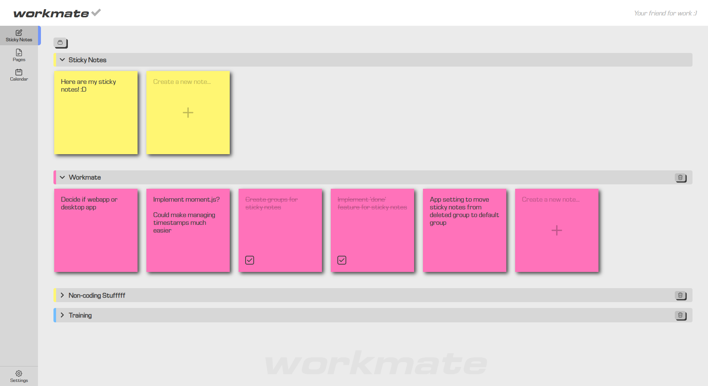
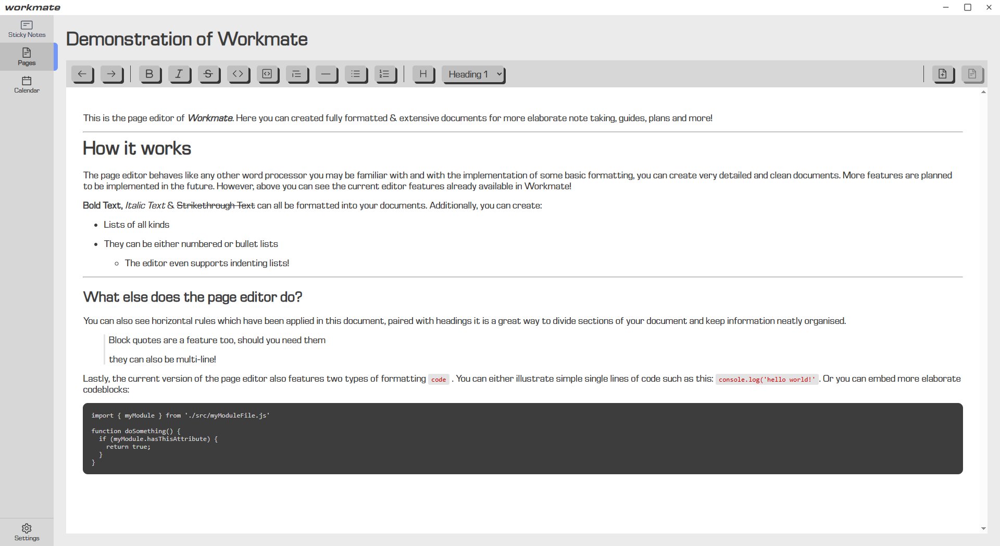
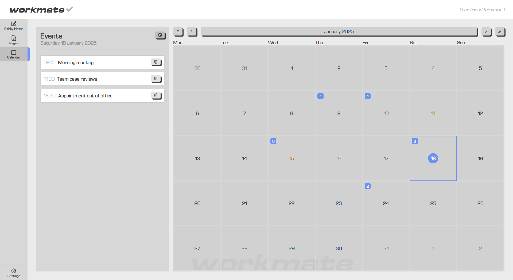
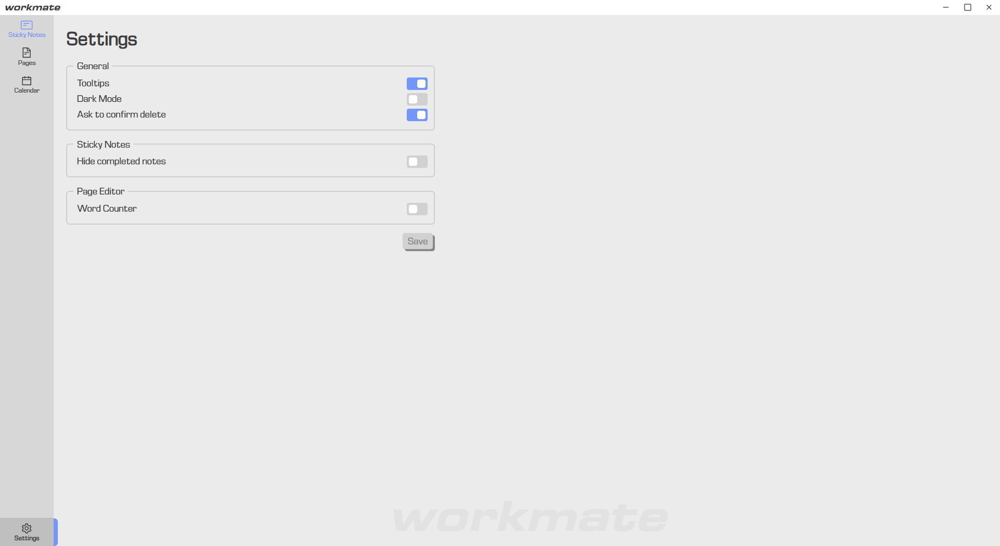

# Workmate (0.1.0)

Simple work planner app, designed for ease of use & convenience over power. For version 0.1 abilities of this application will be
 - 'Sticky notes' for quick notes, they can be created & organised in groups.
 - 'Pages' for detailed and well annotated documentation. They are endless, single page documents with a number of formatting features available.
 - 'Calendar' is a standard planner calendar, with the feature of being able to create scheduled events on chosen days.

 ## Demonstration Screenshots

## Development Installation
1. Install the nodejs dependencies using `npm i`

2. Simply run the following command:
    `npm run dev-desktop`

4. Once Tauri has completed building the desktop window, the app should automatically be open & ready to use!

## How it works
The frontend is a typical `React` implementation, the backend (originally handled via an `ExpressJS` service) is handled by the Tauri window and it's
available API's. The data files used by workmate are automatically generated in their '`AppData`' directory, which tauri resolves to `\Users\<your-user>\AppData\Roaming\com.benctrl.workmate`. In this directory you will find the two essential files necessary for workmate to operate:
 - `workmate.db` : An essential file that contains all the data & entities (aside from app configuration data) managed by workmate.
 - `app_settings.json` : A JSON file storing all the app configuration set by the user via the UI.

## Notes
[07/02/25] The `demo/app_settings.json` file is now redundant, if you still have it stored locally in your project you can delete it as the file is now automatically generated by the Tauri window.
