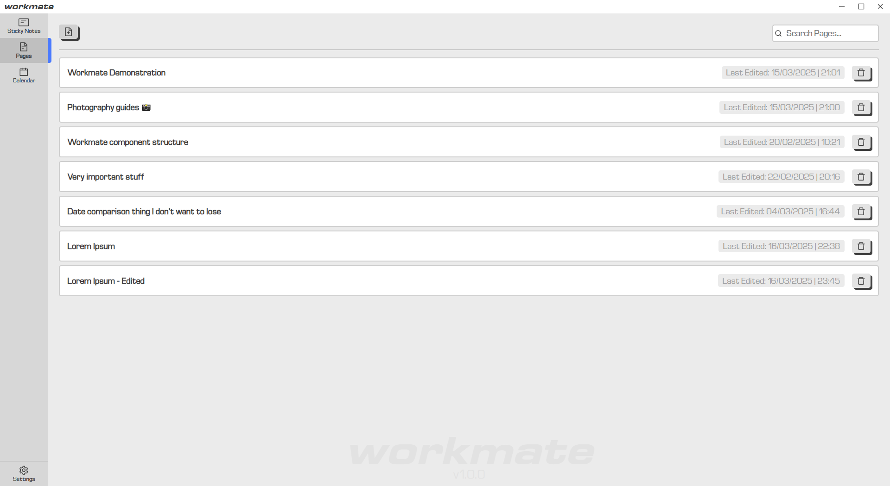
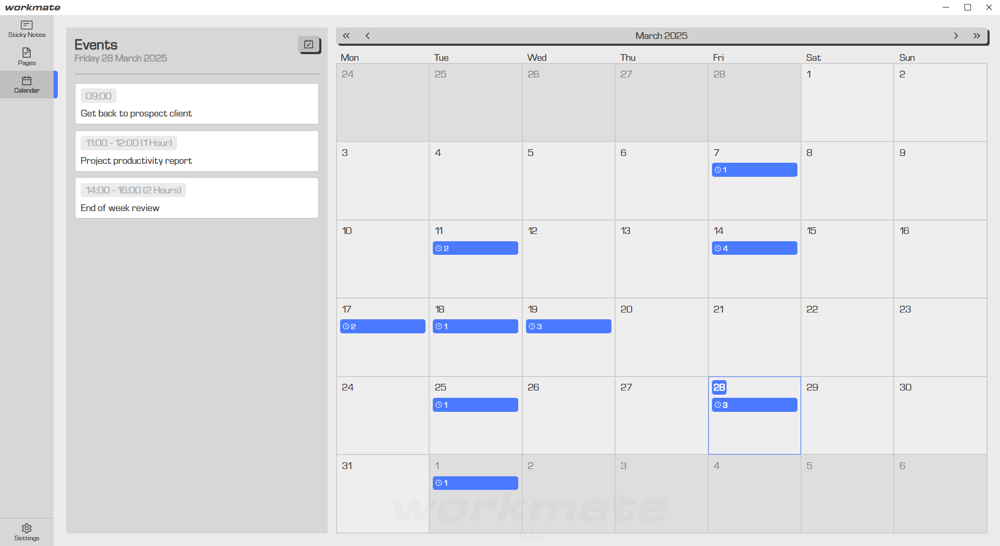
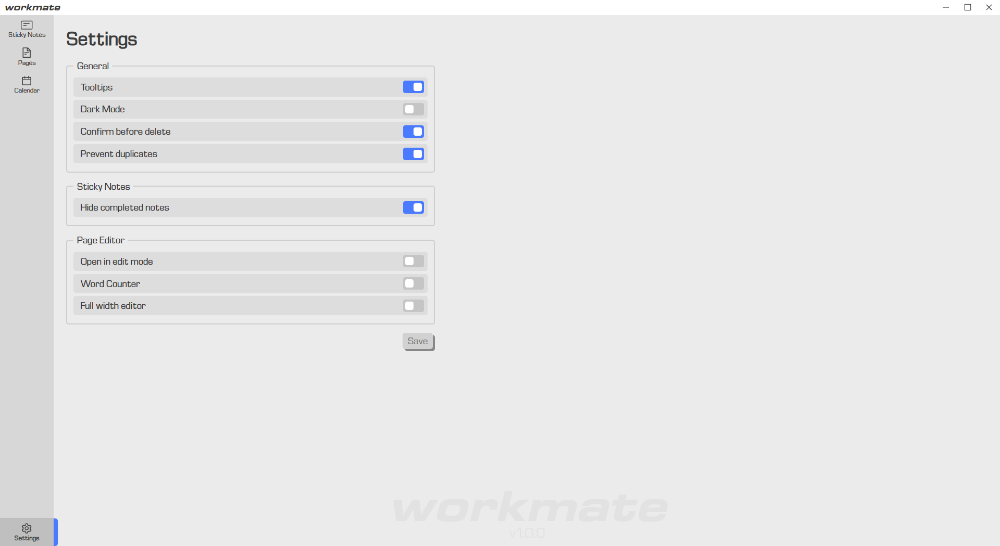
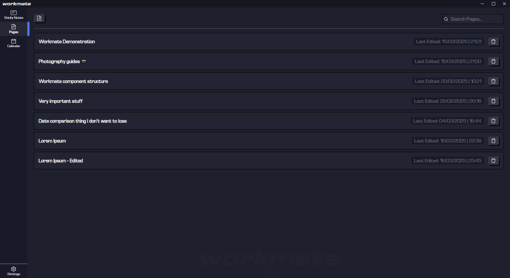
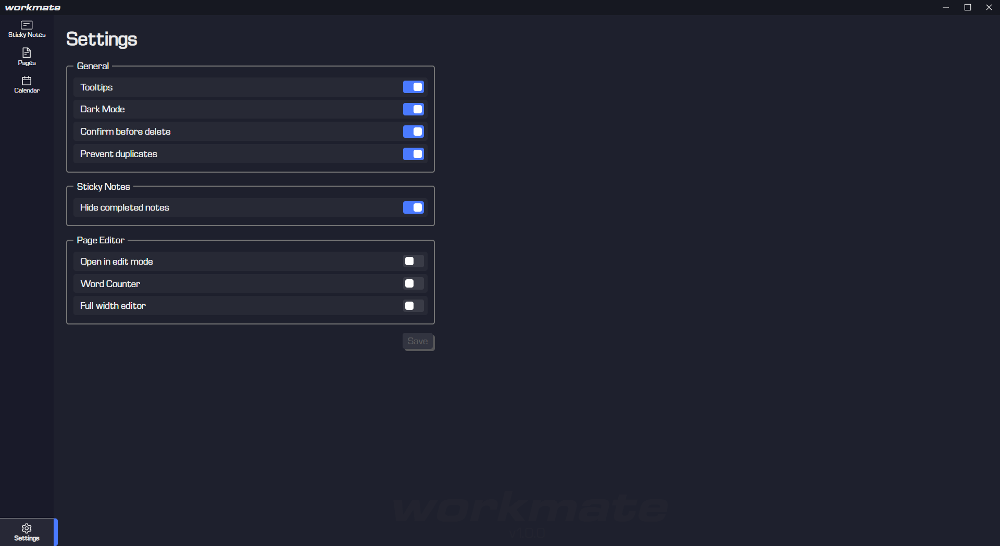

# Workmate (0.1.0)

Simple work planner app, designed for ease of use & convenience over power.
Each main feature of this app are separated into 'workspaces'.

## Features (Workspaces)
### Sticky Notes
This workspace allows you to create short-quick notes. Each note takes a limited number of characters & new lines but allows you to do so quickly.
Each note can be edited inline, with an additional feature of being able to 'complete' each note with the checkbox.

#### Groups
Sticky note groups can also be created to help organise sticky notes. Each installation of workmate comes with a default group named simply "Sticky Notes"
that cannot have it's title edited, neither can the group be deleted. The group colour can be changed however.

#### Hiding Completed Notes
Notes that are marked as complete can be hidden from view to save space & declutter the workspace. This is a setting that can be configured in the apps settings.

### Pages
This workspace can be used to create elaborate, formatted documents where users can create documents for more in depth note taking or documentation.
The page is constructed as an WSYIWYG editor and supports basic formatting & features such as:
 - Font formatting (Bold, Italic, Underline, Strikethrough & Headings)
 - Font Alignment
 - Inline code
 - Separate code blocks
 - Block quotes
 - Horizontal Rules
 - Lists (ordered & unordered)
 - Tables

### Calendar
This workspace is a simple calendar that tracks the current date and also allows users to create schedules events for any day selected.

#### Events
Events are comprised of two sets of data: The event title & the scheduled date/time of the event. The titles of existing events can be edited inline
in this workspace by simply clicking on the title of the existing event. This will toggle the edit mode of the event and allow you to make the changes
you wish.

 ## Demonstration Screenshots

Light Mode

  
  
  
  
  

Dark Mode

  
  
  
  
  

## Development Installation
1. Install the nodejs dependencies using `npm i`

2. Simply run the following command:
    `npm run dev-desktop`

4. Once Tauri has completed building the desktop window, the app should automatically be open & ready to use!

## How it works
The frontend is a typical `React` implementation, the backend (originally handled via an `ExpressJS` service) is handled by the Tauri window and it's
available API's. The data files used by workmate are automatically generated in their '`AppData`' directory, which tauri resolves to `\Users\<your-user>\AppData\Roaming\com.benctrl.workmate`. In this directory you will find the two essential files necessary for workmate to operate:
 - `workmate.db` : An essential file that contains all the data & entities (aside from app configuration data) managed by workmate.
 - `app_settings.json` : A JSON file storing all the app configuration set by the user via the UI.

## Notes
[07/02/25] The `demo/app_settings.json` file is now redundant, if you still have it stored locally in your project you can delete it as the file is now automatically generated by the Tauri window.
